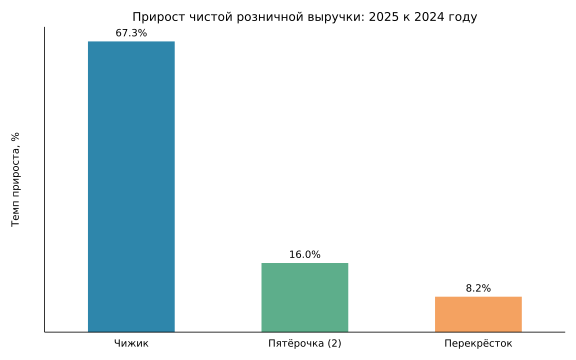
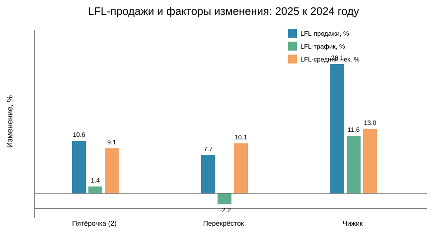
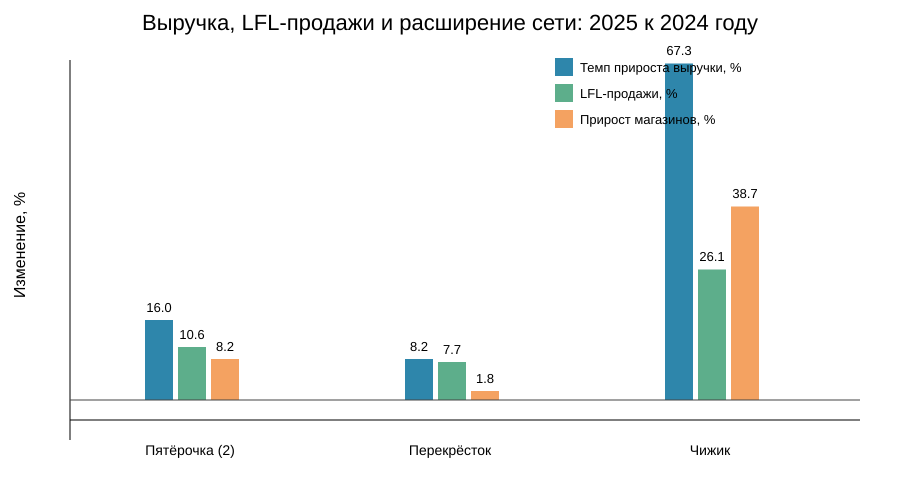

# X5 Retail Analysis

## О проекте

Сравнение «Пятёрочки», «Перекрёстка» и «Чижика» по выручке, LFL-показателям и расширению сети.

Вопрос проекта: почему динамика выручки этих сетей в 2025 году различалась?

## Данные

Источник — [официальная страница X5](https://www.x5.ru/en/investors/financial-and-operational-results/). Использован Excel *Financial and Operating Results (RUB)*, лист `Operating Results`. Для годового сравнения использованы периоды «2024 Скорр.» и «2025 (2)». В репозитории лежит подготовленная таблица для анализа; исходный Excel при необходимости можно скачать с сайта X5.

Выручка указана в млн руб., торговая площадь — в тыс. кв. м.

## Инструменты

- Python
- pandas
- Matplotlib

## Что посчитано

- структура чистой розничной выручки в 2025 году;
- изменение выручки между 2024 и 2025 годами;
- LFL-продажи, LFL-трафик и LFL-средний чек;
- изменение количества магазинов и торговой площади.

## Ключевые выводы

- «Пятёрочка» сформировала 79,2% выручки трёх сетей в 2025 году. Это показывает её доминирующий масштаб; доля рассчитана только среди трёх рассматриваемых сетей.
- У «Пятёрочки» самый большой абсолютный прирост выручки — 499 437 млн руб., или 16,0%. Одновременно LFL-продажи выросли на 10,6%, а число магазинов — на 8,2%; по этим данным нельзя точно разделить вклад LFL-продаж и расширения сети в рост выручки.
- «Чижик» показал самый высокий относительный прирост выручки — 67,3%. Его LFL-продажи выросли на 26,1%, число магазинов — на 38,7%, а торговая площадь — на 38,0%. У Чижика одновременно росли и показатели сопоставимых магазинов, и сама сеть. По этим данным нельзя точно определить вклад каждого фактора в рост выручки.
- У Пятёрочки и Чижика рост LFL-продаж сопровождался ростом и трафика, и среднего чека. У Перекрёстка снижение трафика компенсировалось ростом среднего чека.
- У «Перекрёстка» выручка выросла на 8,2%, но физическая сеть почти не расширилась: магазины — на 1,8%, площадь — на 0,8%; причины динамики трафика в данных не раскрыты.
- Разная динамика сетей наблюдалась одновременно в LFL-показателях и темпах расширения. Сравнение показывает связь показателей, а не причинно-следственную зависимость.

## Что это значит для бизнеса

- Чижик стоит отдельно рассматривать как сеть в фазе быстрого масштабирования: одновременно растут LFL-показатели и физическая сеть. По имеющимся данным нельзя точно разделить вклад этих факторов в рост выручки.
- Для Перекрёстка отдельного внимания требует снижение LFL-трафика при росте среднего чека. Текущих данных недостаточно, чтобы определить причину снижения трафика.

## Как запустить

1. Установить зависимости: `pip install -r requirements.txt`.
2. Запустить анализ: `python src/analyze_revenue.py`.
3. Если нужно заново подготовить данные из исходной отчётности, скачать Excel X5 в `data/x5_results.xlsx` и выполнить `python src/prepare_data.py`.

## Визуализации

### Темпы прироста чистой розничной выручки

### LFL-продажи, трафик и средний чек

### Выручка, LFL-продажи и число магазинов

## Ограничения анализа

- Использованы публичные агрегированные данные за 2024–2025 годы только по трём сетям.
- По этим данным нельзя точно разделить вклад LFL-продаж и расширения сети в рост выручки.
- Наблюдаемые связи между показателями не доказывают причинность.